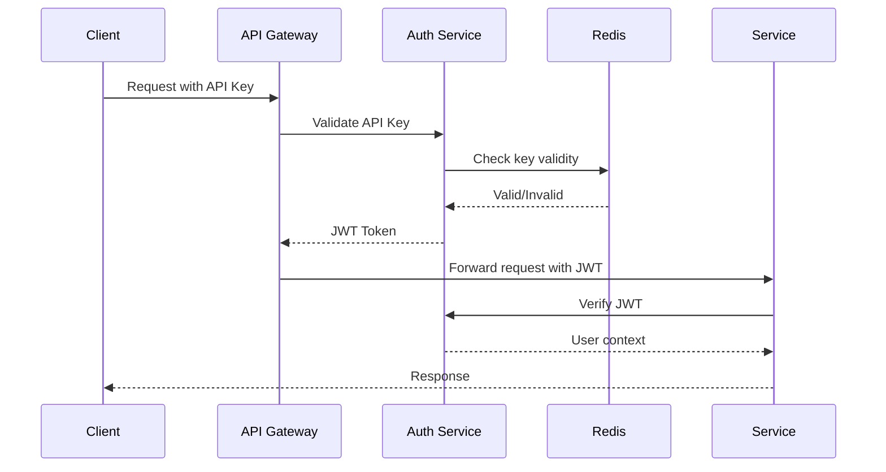

FrexTech AI Simulations - System Architecture

Overview

FrexTech AI Simulations is a distributed system for generating, editing, and rendering 3D worlds using AI. The architecture is designed for scalability, flexibility, and high performance across research, development, and production environments.

System Design Principles

1. Modularity: Independent components that can be developed, tested, and deployed separately
2. Scalability: Horizontal scaling for compute-intensive operations
3. Fault Tolerance: Graceful degradation and automatic recovery
4. Extensibility: Easy integration of new models and techniques
5. Reproducibility: Deterministic behavior and experiment tracking
6. Security: Multi-layered security with defense in depth

High-Level Architecture

```
┌─────────────────────────────────────────────────────────────────────────┐
│                           Client Applications                            │
│  ┌──────────┐  ┌──────────┐  ┌──────────┐  ┌──────────┐  ┌──────────┐  │
│  │   Web    │  │  Mobile  │  │   CLI    │  │    SDK   │  │  Unity   │  │
│  │  Frontend│  │   App    │  │  Tools   │  │ (Python) │  │  Plugin  │  │
│  └──────────┘  └──────────┘  └──────────┘  └──────────┘  └──────────┘  │
└──────────────────────────────┬──────────────────────────────────────────┘
                               │ HTTPS/WebSocket
┌─────────────────────────────────────────────────────────────────────────┐
│                     API Gateway & Load Balancer                         │
│  ┌──────────────────────────────────────────────────────────────────┐  │
│  │                     Cloudflare / Nginx / ALB                     │  │
│  │  • SSL Termination • Rate Limiting • DDoS Protection             │  │
│  │  • Request Routing • Caching • Authentication                    │  │
│  └──────────────────────────────────────────────────────────────────┘  │
└──────────────────────────────┬──────────────────────────────────────────┘
                               │
┌─────────────────────────────────────────────────────────────────────────┐
│                           Application Layer                             │
│  ┌──────────────────────────────────────────────────────────────────┐  │
│  │                        FastAPI / ASGI Server                     │  │
│  │  • REST API • WebSocket • Async Processing • Middleware Chain    │  │
│  └──────────────────────────────────────────────────────────────────┘  │
│  ┌──────────┐  ┌──────────┐  ┌──────────┐  ┌──────────┐  ┌──────────┐  │
│  │  Auth    │  │  Rate    │  │  Cache   │  │  Logging │  │ Monitoring│  │
│  │ Service  │  │ Limiter  │  │  Layer   │  │ Pipeline │  │   Agent   │  │
│  └──────────┘  └──────────┘  └──────────┘  └──────────┘  └──────────┘  │
└──────────────────────────────┬──────────────────────────────────────────┘
                               │
┌─────────────────────────────────────────────────────────────────────────┐
│                          Core Services Layer                            │
│  ┌──────────────────────────────────────────────────────────────────┐  │
│  │                    Message Queue (RabbitMQ)                      │  │
│  │  • Job Distribution • Task Prioritization • Dead Letter Queue    │  │
│  └──────────────────────────────────────────────────────────────────┘  │
│                                                                         │
│  ┌──────────────────────────────────────────────────────────────────┐  │
│  │                 Worker Orchestrator (Celery)                     │  │
│  │  • Dynamic Scaling • GPU Scheduling • Fault Recovery             │  │
│  └──────────────────────────────────────────────────────────────────┘  │
│                                                                         │
│  ┌──────────┐  ┌──────────┐  ┌──────────┐  ┌──────────┐  ┌──────────┐  │
│  │Generation│  │ Editing  │  │ Rendering│  │  Export  │  │ Training │  │
│  │ Workers  │  │ Workers  │  │ Workers  │  │ Workers  │  │ Workers  │  │
│  │ (GPU)    │  │ (GPU/CPU)│  │ (GPU)    │  │ (CPU)    │  │ (GPU)    │  │
│  └──────────┘  └──────────┘  └──────────┘  └──────────┘  └──────────┘  │
└──────────────────────────────┬──────────────────────────────────────────┘
                               │
┌─────────────────────────────────────────────────────────────────────────┐
│                          Data Layer                                     │
│  ┌──────────────────────────────────────────────────────────────────┐  │
│  │                      Object Storage (S3)                         │  │
│  │  • World Data • Checkpoints • Exports • Previews • Cache         │  │
│  └──────────────────────────────────────────────────────────────────┘  │
│  ┌──────────────────────────────────────────────────────────────────┐  │
│  │                    Database Cluster (PostgreSQL)                 │  │
│  │  • Metadata • User Data • Jobs • Experiments • Analytics         │  │
│  └──────────────────────────────────────────────────────────────────┘  │
│  ┌──────────────────────────────────────────────────────────────────┐  │
│  │                 Vector Database (Pinecone/Qdrant)                │  │
│  │  • Embeddings • Semantic Search • Similarity Matching            │  │
│  └──────────────────────────────────────────────────────────────────┘  │
│  ┌──────────────────────────────────────────────────────────────────┐  │
│  │                 Cache (Redis)                                    │  │
│  │  • Session Data • Rate Limits • Job Results • Model Cache        │  │
│  └──────────────────────────────────────────────────────────────────┘  │
└─────────────────────────────────────────────────────────────────────────┘
```

Component Details

1. API Layer

1.1 FastAPI Application

· Framework: FastAPI with ASGI (Uvicorn)
· Concurrency: Async/await pattern for I/O operations
· Middleware: CORS, compression, security headers, request ID
· Documentation: Auto-generated OpenAPI/Swagger UI
· Health Checks: Liveness, readiness, and dependency checks

1.2 Authentication Service

· Method: JWT tokens with refresh mechanism
· Providers: API keys, OAuth2 (Google, GitHub), SSO
· Storage: Redis for token blacklisting
· Rate Limiting: Token bucket algorithm per user/IP

1.3 Request Pipeline

```
Request → Authentication → Rate Limiting → Validation → Processing → Response
                                   ↓
                               Monitoring
                                   ↓
                               Logging
```

2. Core AI Components

2.1 World Model Architecture

```
┌─────────────────────────────────────────────────────────────┐
│                    Multi-Modal Transformer                   │
│  ┌──────────┐  ┌──────────┐  ┌──────────┐  ┌──────────┐    │
│  │  Text    │  │  Image   │  │  Video   │  │  3D      │    │
│  │ Encoder  │  │ Encoder  │  │ Encoder  │  │ Encoder  │    │
│  │ (CLIP)   │  │ (ViT)    │  │ (S3D)    │  │ (PointNet)│    │
│  └──────────┘  └──────────┘  └──────────┘  └──────────┘    │
│           ↓           ↓           ↓           ↓              │
│  ┌──────────────────────────────────────────────────────┐  │
│  │            Cross-Attention Fusion Layer              │  │
│  │  • Multi-head attention across modalities            │  │
│  │  • Dynamic weighting based on input type             │  │
│  │  • Learned fusion gating                             │  │
│  └──────────────────────────────────────────────────────┘  │
│                              ↓                              │
│  ┌──────────────────────────────────────────────────────┐  │
│  │            Latent Diffusion Transformer               │  │
│  │  • 256-dimensional latent space                       │  │
│  │  • 24 transformer blocks (8B parameters)              │  │
│  │  • Conditional generation via cross-attention         │  │
│  │  • Classifier-free guidance (CFG)                     │  │
│  └──────────────────────────────────────────────────────┘  │
│                              ↓                              │
│  ┌──────────────────────────────────────────────────────┐  │
│  │            Representation Decoders                    │  │
│  │  ┌────────────┐ ┌─────────────┐ ┌──────────────┐    │  │
│  │  │ Gaussian   │ │   NeRF      │ │    Mesh      │    │  │
│  │  │ Splatting  │ │  Decoder    │ │   Decoder    │    │  │
│  │  │ Decoder    │ │             │ │              │    │  │
│  │  └────────────┘ └─────────────┘ └──────────────┘    │  │
│  └──────────────────────────────────────────────────────┘  │
└─────────────────────────────────────────────────────────────┘
```

2.2 Gaussian Splatting Pipeline

```python
# Simplified pipeline
def generate_gaussian_world(latent_code):
    # Step 1: Generate initial gaussians
    positions = position_decoder(latent_code)
    rotations = rotation_decoder(latent_code)
    scales = scale_decoder(latent_code)
    colors = color_decoder(latent_code)
    opacities = opacity_decoder(latent_code)
    
    # Step 2: Optimize via differentiable rendering
    for iteration in range(optimization_steps):
        # Render image
        rendered = rasterize_gaussians(positions, rotations, scales, 
                                      colors, opacities, camera)
        
        # Compute loss against target
        loss = compute_loss(rendered, target_image)
        
        # Backpropagation through rasterization
        loss.backward()
        optimize_gaussians()
    
    # Step 3: Adaptive density control
    prune_gaussians(threshold)
    split_gaussians(high_gradient)
    
    return optimized_gaussians
```

2.3 Neural Radiance Fields (NeRF) Pipeline

```python
def generate_nerf_world(latent_code):
    # Instantiate neural radiance field
    nerf = InstantNGP(latent_code)
    
    # Volume rendering
    def render_rays(ray_origins, ray_directions):
        samples = sample_along_rays(ray_origins, ray_directions)
        densities = nerf.density(samples)
        colors = nerf.color(samples, ray_directions)
        
        # Alpha compositing
        accumulated_color = integrate(densities, colors)
        depth = integrate(densities, samples.t)
        
        return accumulated_color, depth
    
    return nerf, render_rays
```

3. Editing System

3.1 Region-Aware Editing Pipeline

```
Input World → Feature Extraction → Region Selection → Edit Application → Consistency Check
       ↓               ↓                 ↓                  ↓                  ↓
  Gaussian/NeRF   Segmentation      User/ML-based      Local Inference    Global Optimization
                   Maps              Selection         with Constraints      (Poisson Blending)
```

3.2 Scene Expansion Algorithm

```python
def expand_scene(world, direction, distance):
    # 1. Detect boundary
    boundary = detect_boundary(world, direction)
    
    # 2. Extract context features
    context_features = extract_context(boundary)
    
    # 3. Generate continuation
    continuation = generate_continuation(
        context_features, 
        direction, 
        distance,
        style_prompt
    )
    
    # 4. Seamless blending
    blended = poisson_blend(boundary, continuation)
    
    # 5. Update world representation
    expanded_world = insert_continuation(world, blended)
    
    return expanded_world
```

4. Rendering System

4.1 Multi-Engine Renderer

```
┌─────────────────────────────────────────────────────────────┐
│                     Render Manager                          │
│  ┌──────────────────────────────────────────────────────┐  │
│  │                    Engine Selector                   │  │
│  │  • Quality/performance trade-off                     │  │
│  │  • Format compatibility                               │  │
│  │  • Hardware availability                              │  │
│  └──────────────────────────────────────────────────────┘  │
│  ┌──────────┐  ┌───────────┐  ┌──────────┐  ┌──────────┐  │
│  │  WebGL   │  │   Ray     │  │ Raster   │  │  Path    │  │
│  │  Engine  │  │ Tracing   │  │ Engine   │  │ Tracing  │  │
│  │          │  │  Engine   │  │          │  │  Engine  │  │
│  │ (Fast)   │  │ (Quality) │  │ (Hybrid) │  │ (Cinema) │  │
│  └──────────┘  └───────────┘  └──────────┘  └──────────┘  │
└─────────────────────────────────────────────────────────────┘
```

4.2 WebGL Engine (Real-time)

```javascript
// GLSL Shader for Gaussian Splatting
#version 300 es
precision highp float;

in vec2 vTexCoord;
in vec3 vPosition;
in vec4 vColor;
in vec3 vCovarianceA;
in vec3 vCovarianceB;

uniform mat4 uViewMatrix;
uniform mat4 uProjectionMatrix;
uniform vec3 uCameraPosition;

out vec4 fragColor;

void main() {
    // Compute 2D covariance
    vec3 d = vPosition - uCameraPosition;
    float dist2 = dot(d, d);
    
    // Project gaussian to 2D
    mat3 Vrk = mat3(
        vCovarianceA.x, vCovarianceA.y, vCovarianceA.z,
        vCovarianceA.y, vCovarianceB.x, vCovarianceB.y,
        vCovarianceA.z, vCovarianceB.y, vCovarianceB.z
    );
    
    // Approximate 2D covariance
    vec2 pixel_coord = project_to_screen(vPosition);
    float alpha = compute_alpha(vPosition, dist2);
    
    // Blend with depth ordering
    fragColor = vColor * alpha;
}
```

5. Data Flow

5.1 Generation Pipeline

```
User Request → API → Job Queue → Worker Selection → Model Loading → 
              ↓          ↓           ↓               ↓
            Auth      Priority    GPU Memory      Checkpoint
           Check      Queue       Check           Cache

Inference → Post-processing → Storage → Notification → User
    ↓           ↓              ↓           ↓          ↓
Generation   Optimization    S3 Upload  Webhook/    Response
                              DB Update   Email
```

5.2 Training Pipeline

```
Data Preparation → Distributed Training → Validation → Checkpointing → Deployment
        ↓               ↓                   ↓             ↓             ↓
   DataLoader      Horovod/    Metrics Collection  Model Registry  CI/CD Pipeline
   (PyTorch)       DDP          (TensorBoard)      (MLflow)        (Kubernetes)
```

6. Storage Architecture

6.1 Data Hierarchy

```
s3://frextech-sim/
├── users/
│   ├── {user_id}/
│   │   ├── worlds/
│   │   │   ├── {world_id}/
│   │   │   │   ├── source/           # Original inputs
│   │   │   │   ├── checkpoints/      # Model checkpoints
│   │   │   │   ├── representations/  # Gaussian/NeRF/Mesh
│   │   │   │   ├── exports/          # Various formats
│   │   │   │   └── previews/         # Rendered previews
│   │   │   └── ...
│   │   └── jobs/
│   │       └── {job_id}/             # Job artifacts
│   └── ...
├── models/
│   ├── world_model/
│   │   ├── v1.0/
│   │   ├── v1.1/
│   │   └── ...
│   ├── encoders/
│   └── cache/
├── datasets/
│   ├── raw/
│   ├── processed/
│   └── embeddings/
└── system/
    ├── logs/
    ├── backups/
    └── temp/
```

6.2 Database Schema

```sql
-- Core tables
CREATE TABLE users (
    id UUID PRIMARY KEY,
    email VARCHAR(255) UNIQUE,
    api_key_hash VARCHAR(512),
    tier VARCHAR(50),
    credits DECIMAL(10,2),
    created_at TIMESTAMPTZ DEFAULT NOW()
);

CREATE TABLE jobs (
    id UUID PRIMARY KEY,
    user_id UUID REFERENCES users(id),
    type VARCHAR(50), -- 'generation', 'edit', 'export'
    status VARCHAR(50), -- 'queued', 'processing', 'completed', 'failed'
    input_json JSONB,
    output_json JSONB,
    error_message TEXT,
    created_at TIMESTAMPTZ DEFAULT NOW(),
    started_at TIMESTAMPTZ,
    completed_at TIMESTAMPTZ,
    INDEX idx_jobs_user_status (user_id, status),
    INDEX idx_jobs_created (created_at DESC)
);

CREATE TABLE worlds (
    id UUID PRIMARY KEY,
    user_id UUID REFERENCES users(id),
    name VARCHAR(255),
    format VARCHAR(50), -- 'gaussian', 'nerf', 'mesh'
    storage_path VARCHAR(1024),
    metadata JSONB,
    bounding_box NUMERIC[3][2], -- [[min_x, max_x], [min_y, max_y], [min_z, max_z]]
    size_bytes BIGINT,
    created_at TIMESTAMPTZ DEFAULT NOW(),
    modified_at TIMESTAMPTZ DEFAULT NOW(),
    INDEX idx_worlds_user (user_id),
    INDEX idx_worlds_created (created_at DESC)
);
```

7. Deployment Architecture

7.1 Kubernetes Cluster

```
┌─────────────────────────────────────────────────────────────────────────┐
│                         Kubernetes Cluster                               │
│  ┌──────────────────────────────────────────────────────────────────┐  │
│  │                         Control Plane                           │  │
│  │  • API Server • Scheduler • Controller Manager • etcd           │  │
│  └──────────────────────────────────────────────────────────────────┘  │
│                                                                         │
│  ┌──────────────────────────────────────────────────────────────────┐  │
│  │                          Node Pool                               │  │
│  │  ┌─────────────┐ ┌─────────────┐ ┌─────────────┐ ┌─────────────┐  │
│  │  │    API      │ │   Worker    │ │   Worker    │ │   Worker    │  │
│  │  │   Pods      │ │    Pods     │ │    Pods     │ │    Pods     │  │
│  │  │ (CPU)       │ │   (GPU)     │ │   (GPU)     │ │   (CPU)     │  │
│  │  └─────────────┘ └─────────────┘ └─────────────┘ └─────────────┘  │
│  └──────────────────────────────────────────────────────────────────┘  │
│                                                                         │
│  ┌──────────────────────────────────────────────────────────────────┐  │
│  │                        Storage Classes                           │  │
│  │  • Fast SSD (models cache) • HDD (bulk storage) • Network (shared) │  │
│  └──────────────────────────────────────────────────────────────────┘  │
└─────────────────────────────────────────────────────────────────────────┘
```

7.2 Service Mesh (Istio)

```
┌───────────┐    ┌───────────┐    ┌───────────┐    ┌───────────┐
│   API     │────│   Auth    │────│  Worker   │────│  Storage  │
│ Gateway   │    │ Service   │    │ Service   │    │ Service   │
└───────────┘    └───────────┘    └───────────┘    └───────────┘
      │                │                │                │
┌───────────────────────────────────────────────────────────────┐
│                      Istio Service Mesh                       │
│  • Traffic Management • Security • Observability • Resilience │
└───────────────────────────────────────────────────────────────┘
```

8. Monitoring & Observability

8.1 Metrics Collection

```yaml
# Prometheus metrics
metrics:
  - name: api_requests_total
    type: counter
    labels: [endpoint, method, status_code]
  
  - name: inference_latency_seconds
    type: histogram
    buckets: [0.1, 0.5, 1, 2, 5, 10, 30]
  
  - name: gpu_utilization_percent
    type: gauge
    labels: [gpu_id, model_name]
  
  - name: queue_length
    type: gauge
    labels: [queue_name, priority]
```

8.2 Logging Pipeline

```
Application Logs → Fluentd/Fluent Bit → Elasticsearch → Kibana
       ↓                    ↓                  ↓           ↓
    JSON format      Log aggregation    Indexing &     Visualization
    with context      & enrichment      Search
```

8.3 Alerting Rules

```yaml
alerts:
  - name: HighErrorRate
    expr: rate(api_errors_total[5m]) > 0.1
    for: 2m
    labels:
      severity: warning
    annotations:
      summary: "High error rate detected"
      
  - name: GPUOutOfMemory
    expr: gpu_memory_used_bytes / gpu_memory_total_bytes > 0.9
    for: 1m
    labels:
      severity: critical
    annotations:
      summary: "GPU memory almost full"
```

9. Security Architecture

9.1 Defense Layers

```
┌─────────────────────────────────────────────────────────────┐
│                  External Security Layer                     │
│  • Cloudflare WAF • DDoS Protection • Rate Limiting         │
└─────────────────────────────────────────────────────────────┘
                               ↓
┌─────────────────────────────────────────────────────────────┐
│                 Network Security Layer                       │
│  • VPC Isolation • Security Groups • Network ACLs           │
└─────────────────────────────────────────────────────────────┘
                               ↓
┌─────────────────────────────────────────────────────────────┐
│                 Application Security Layer                   │
│  • Input Validation • Authentication • Authorization         │
│  • SQL Injection Prevention • XSS Protection                │
└─────────────────────────────────────────────────────────────┘
                               ↓
┌─────────────────────────────────────────────────────────────┐
│                 Data Security Layer                          │
│  • Encryption at Rest • Encryption in Transit               │
│  • Key Management • Data Masking                            │
└─────────────────────────────────────────────────────────────┘
```

9.2 Authentication Flow



10. Performance Considerations

10.1 Caching Strategy

```python
class MultiLevelCache:
    def __init__(self):
        self.l1 = LRUCache(maxsize=1000)  # In-memory (hot data)
        self.l2 = RedisCache()           # Shared cache (warm data)
        self.l3 = DiskCache()            # Local disk (cold data)
    
    async def get(self, key):
        # Try L1
        if value := self.l1.get(key):
            return value
        
        # Try L2
        if value := await self.l2.get(key):
            self.l1.set(key, value)
            return value
        
        # Try L3
        if value := await self.l3.get(key):
            await self.l2.set(key, value)
            self.l1.set(key, value)
            return value
        
        # Cache miss
        return None
```

10.2 GPU Memory Management

```python
class GPUMemoryManager:
    def __init__(self, devices):
        self.devices = devices
        self.models = {}  # model_id -> (device, memory_used)
        self.queue = asyncio.Queue()
        
    async def allocate_model(self, model_id, memory_needed):
        # Find device with enough memory
        for device in self.devices:
            if self.get_free_memory(device) >= memory_needed:
                await self.load_model(device, model_id)
                return device
        
        # No immediate space, wait for cleanup
        await self.queue.put((model_id, memory_needed))
        return await self.wait_for_space(model_id, memory_needed)
```

11. Cost Optimization

11.1 Resource Scheduling

```
Algorithm: Cost-Aware Resource Scheduler

Input: Job requests with priorities and resource requirements
Output: Schedule that minimizes cost while meeting SLAs

Steps:
1. Classify jobs into priority tiers (P0: real-time, P1: batch)
2. For P0 jobs:
   - Use spot instances if latency budget allows
   - Pre-warm GPU instances for expected load
3. For P1 jobs:
   - Batch process during off-peak hours
   - Use cheaper instance types
   - Implement job coalescing
4. Dynamic scaling based on:
   - Queue length
   - Time of day
   - Cost per hour
```

12. Disaster Recovery

12.1 Backup Strategy

```yaml
backup:
  frequency:
    databases: "15 minutes"  # Continuous WAL archiving
    models: "daily"
    user_data: "hourly"
  
  retention:
    daily: 30 days
    weekly: 12 weeks
    monthly: 36 months
  
  recovery:
    rto: "4 hours"  # Recovery Time Objective
    rpo: "15 minutes"  # Recovery Point Objective
```

13. Future Architecture Directions

13.1 Edge Computing

```
Central Cloud → Regional Edge Nodes → User Devices
     ↓                ↓                 ↓
Heavy training    Light inference    Client-side
& storage         & caching          rendering
```

13.2 Federated Learning

```python
class FederatedTraining:
    def __init__(self):
        self.central_model = WorldModel()
        self.clients = []  # Edge devices with local data
        
    async def train_round(self):
        # 1. Send model to clients
        for client in self.clients:
            await client.update_model(self.central_model)
        
        # 2. Local training on client data
        client_updates = await asyncio.gather(
            *[client.train_locally() for client in self.clients]
        )
        
        # 3. Secure aggregation
        aggregated_update = secure_aggregation(client_updates)
        
        # 4. Update central model
        self.central_model.apply_update(aggregated_update)
```

Conclusion

This architecture provides a robust foundation for the FrexTech AI Simulations platform. It balances performance, scalability, and maintainability while allowing for future expansion. Each component is designed to be independently scalable and replaceable, ensuring the system can evolve with technological advancements and changing requirements.

---

Last Updated: January 1, 2024
Architecture Version: 2.0
Maintainer: Platform Engineering Team
Contact: architecture@frextech-sim.com